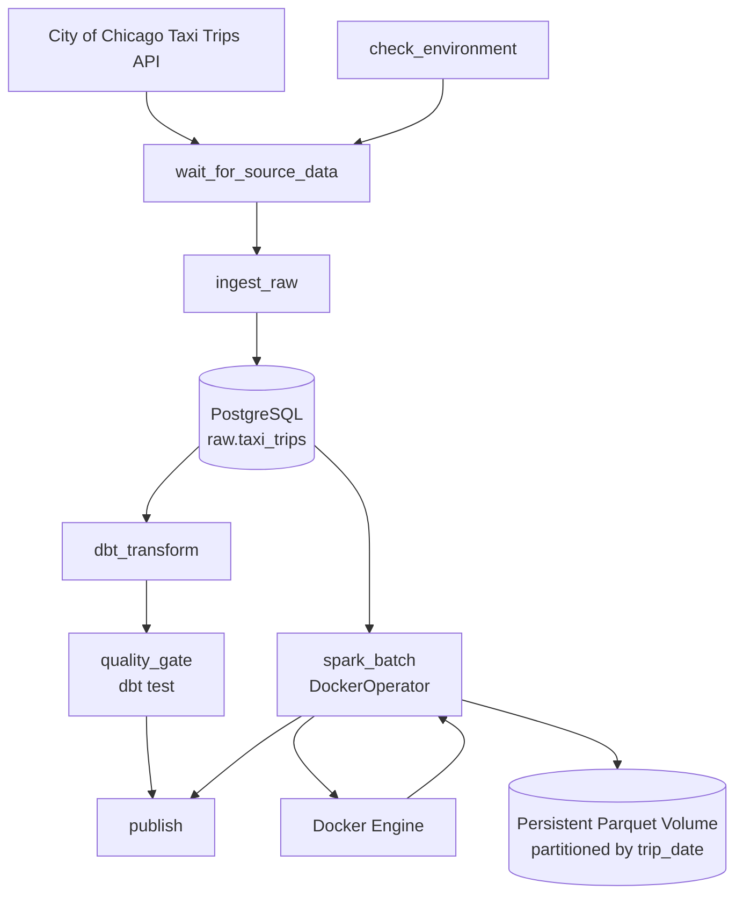

# Chicago Taxi Data Platform

A containerized batch data platform for ingesting, transforming, validating, and processing Chicago taxi trip data using **Apache Airflow, PostgreSQL, dbt, PySpark, Parquet, Docker, and GitHub Actions**.

The platform is designed around reproducible local deployment, source-aware orchestration, historical backfills, idempotent ingestion, data-quality gates, and persistent analytical storage.

---

## Overview

The project ingests data from the City of Chicago **Taxi Trips (2024-)** dataset and processes it through two downstream paths:

1. **dbt analytical modeling**
   - Raw PostgreSQL data
   - Staging and normalization
   - Dimensional models
   - dbt data-quality tests

2. **Spark batch processing**
   - Reads raw data from PostgreSQL through JDBC
   - Applies typed transformations
   - Writes daily-partitioned Parquet
   - Validates source and output row counts

Apache Airflow coordinates the full workflow.

Unlike a simple daily pipeline, the platform accounts for the upstream dataset's delayed, batch-oriented publication behavior. A source-availability sensor checks whether the required monthly interval is available before expensive ingestion and processing begins.

---

## Architecture



### Runtime topology

Airflow runs as the orchestration layer using the CeleryExecutor.

Spark is **not** kept as a permanently running service. Instead:

```text
Airflow worker
    ↓
DockerOperator
    ↓
Docker daemon
    ↓
temporary Spark container
    ↓
PySpark batch job
    ↓
persistent Parquet volume
```

This separates orchestration from compute and allows Spark containers to remain ephemeral while processed data persists independently.

---

## Data Flow

```text
City of Chicago API
        │
        ▼
Source Availability Sensor
        │
        ▼
Monthly Airflow Data Interval
        │
        ▼
Daily API Chunks
        │
        ▼
Paginated HTTP Requests
        │
        ▼
PostgreSQL Raw Layer
       / \
      /   \
     ▼     ▼
   dbt    Spark
    │       │
    ▼       ▼
 Marts   Parquet
    │    partitions
    ▼       │
Quality     │
Gate        │
     \      /
      \    /
      Publish
```

The Airflow orchestration interval is monthly, while ingestion internally breaks the interval into **daily source chunks**.

This reduces large remote API queries while preserving monthly scheduling semantics.

Spark processes the full Airflow interval in one batch and writes the result into **daily `trip_date` partitions**.

---

## Key Features

### Source-aware orchestration

The upstream source does not behave like a real-time daily feed.

The DAG therefore uses:

```text
@monthly schedule
+
PythonSensor
+
6-hour availability checks
```

The sensor queries:

```sql
SELECT max(trip_start_timestamp)
```

and compares the latest source date against the final date required by the current Airflow data interval.

If the source is not ready:

```text
Sensor returns False
        ↓
task enters reschedule state
        ↓
worker slot is released
        ↓
Airflow checks again later
```

The sensor uses `mode="reschedule"` so it does not occupy a Celery worker while waiting.

---

### Interval-based ingestion

The ingestion CLI accepts an explicit interval:

```bash
python ingest_taxi_trips.py --start-date YYYY-MM-DD --end-date YYYY-MM-DD
```

The interval follows the convention:

```text
[start_date, end_date)
```

For a monthly run such as:

```text
2026-08-01 → 2026-09-01
```

the ingestion process internally executes daily chunks:

```text
08/01 → 08/02
08/02 → 08/03
...
08/31 → 09/01
```

Each daily chunk is independently paginated until the API returns no more records.

---

### HTTP reliability

A reusable `requests.Session` is configured with:

- connection pooling
- connection retries
- read retries
- retries for HTTP 429 and selected 5xx responses
- exponential backoff
- extended read timeout for source queries

The SODA API uses POST requests for read-only queries, so retrying these requests is safe for this workload.

---

### Idempotent raw ingestion

`trip_id` is the natural source key and the primary key of:

```text
raw.taxi_trips
```

Writes use:

```sql
ON CONFLICT (trip_id) DO NOTHING
```

This allows the same historical interval to be rerun without duplicating existing taxi trips.

Each ingestion attempt also records metadata including:

```text
_ingested_at
_batch_id
_source_name
```

---

### Automatic database bootstrap

The raw warehouse schema does not need to be created manually.

The PostgreSQL warehouse mounts:

```text
db/scripts/sql/create_tables.sql
```

into:

```text
/docker-entrypoint-initdb.d/
```

On a fresh PostgreSQL data volume, the container automatically creates:

```text
database: taxi_warehouse
schema:   raw
table:    raw.taxi_trips
```

Existing PostgreSQL volumes are preserved across normal Compose restarts.

---

### dbt transformation and quality gate

dbt transforms the raw ingestion layer into typed analytical models.

The dimensional model includes:

```text
fct_taxi_trips
dim_date
dim_location
dim_company
```

The DAG does not publish downstream results until the dbt quality gate succeeds.

Additional design details are documented in:

```text
docs/data_contract.md
docs/data_model.md
```

---

### Spark batch processing

The Spark job accepts the same Airflow interval as ingestion:

```bash
taxi_batch.py --start-date YYYY-MM-DD --end-date YYYY-MM-DD
```

Spark reads only the requested interval from PostgreSQL using a JDBC predicate:

```sql
WHERE trip_start_timestamp >= start_timestamp
  AND trip_start_timestamp < end_timestamp
```

Filtering therefore occurs before the full raw table is transferred into Spark.

The resulting DataFrame is written as Parquet partitioned by:

```text
trip_date
```

Example:

```text
taxi_trips_by_date/
├── trip_date=2026-08-01/
├── trip_date=2026-08-02/
├── trip_date=2026-08-03/
└── ...
```

---

### Safe Spark reruns

Spark uses dynamic partition overwrite behavior.

When an interval is rerun, Spark replaces only the daily partitions touched by that interval instead of deleting the entire historical Parquet dataset.

This makes historical retries and backfills safe while preserving unrelated partitions.

---

## DAG

The final DAG contains seven tasks:

```text
check_environment
        │
        ▼
wait_for_source_data
        │
        ▼
    ingest_raw
       /   \
      /     \
     ▼       ▼
dbt_transform spark_batch
     │
     ▼
quality_gate
      \       /
       \     /
        ▼   ▼
        publish
```

The dbt and Spark branches execute independently after raw ingestion completes.

`publish` runs only after both the dbt quality gate and Spark batch processing succeed.

---

## Scheduling

The DAG is configured with:

```text
schedule:        @monthly
timezone:        America/Chicago
catchup:         False
max_active_runs: 1
```

### Why monthly?

The City of Chicago source is published with delay rather than behaving as a guaranteed next-day feed.

Running a daily pipeline against unavailable source data would repeatedly create empty or failed runs.

Instead:

```text
monthly schedule
        ↓
source availability check
        ↓
process only when upstream data is ready
```

### Why `catchup=False`?

A fresh installation should not automatically launch every historical interval since 2024.

Historical intervals are processed explicitly through Airflow backfills.

---

## Historical Backfills

The DAG supports explicit monthly historical backfills.

For example, to process August 2026:

```bash
docker compose exec airflow-worker airflow dags backfill project1_taxi_pipeline -s 2026-08-01 -e 2026-08-02
```

The DAG uses the `America/Chicago` timezone. Airflow internally represents scheduled timestamps in UTC, so the one-day CLI search window above safely includes the Chicago-midnight monthly logical boundary while selecting only the August monthly run.

The resulting data interval is:

```text
[2026-08-01, 2026-09-01)
```

Backfills are safe to rerun because:

```text
PostgreSQL raw
→ primary-key conflict handling

Spark Parquet
→ dynamic partition overwrite
```

---

## Quick Start

### Prerequisites

Recommended environment:

- Docker Desktop / Docker Engine
- Docker Compose v2
- Git
- Linux or WSL2
- City of Chicago application token

The project was developed and validated using Docker from WSL.

---

### 1. Clone the repository

```bash
git clone <YOUR_REPOSITORY_URL>
cd chicago-taxi-data-platform
```

---

### 2. Create the environment file

```bash
cp .env.example .env
```

Set the required values in `.env`.

At minimum:

```env
CHICAGO_APP_TOKEN=<your-token>
DOCKER_GID=<docker-socket-group-id>
```

On Linux / WSL, obtain the Docker socket group ID with:

```bash
stat -c '%g' /var/run/docker.sock
```

`DOCKER_GID` allows the Airflow worker to access the mounted Docker socket used by `DockerOperator`.

Do not commit `.env`.

---

### 3. Build the platform images

```bash
docker compose build
```

Spark is an optional Compose profile and must also be built before the DAG can dynamically create Spark containers:

```bash
docker compose --profile manual build spark
```

---

### 4. Initialize Airflow

```bash
docker compose up airflow-init
```

Wait for the initialization container to finish successfully.

---

### 5. Start the platform

```bash
docker compose up -d
```

Check service status:

```bash
docker compose ps
```

The default runtime includes:

```text
Airflow webserver
Airflow scheduler
Airflow worker
Airflow triggerer
Redis
Airflow metadata PostgreSQL
Taxi warehouse PostgreSQL
```

Spark and Flower are not started by default.

---

### 6. Open Airflow

Open:

```text
http://localhost:8080
```

Locate:

```text
project1_taxi_pipeline
```

and enable the DAG if it is paused.

---

### 7. Verify the DAG

```bash
docker compose exec airflow-worker airflow dags list-import-errors
```

List the tasks:

```bash
docker compose exec airflow-worker airflow tasks list project1_taxi_pipeline
```

Expected tasks:

```text
check_environment
wait_for_source_data
ingest_raw
dbt_transform
spark_batch
quality_gate
publish
```

---

### 8. Run a historical interval

Example:

```bash
docker compose exec airflow-worker airflow dags backfill project1_taxi_pipeline -s 2026-08-01 -e 2026-08-02
```

For historical backfill testing, use an interval that is already available in the upstream source.

---

## Docker Compose Profiles

The normal platform does not keep Spark or Flower running continuously.

### Manual Spark profile

Used for Spark image builds and debugging:

```bash
docker compose --profile manual run --rm spark <command>
```

### Flower debug profile

Used when Celery worker monitoring is required:

```bash
docker compose --profile debug up -d flower
```

---

## Persistent Storage

The platform separates compute lifecycle from data lifecycle.

### PostgreSQL

The taxi warehouse uses a Docker named volume.

Raw data therefore survives:

```bash
docker compose down
docker compose up -d
```

Do not use:

```bash
docker compose down -v
```

unless you intentionally want to remove persistent database volumes.

### Parquet

Spark output is stored in the persistent Docker volume:

```text
taxi-parquet-data
```

Inside the Spark container, the dataset is available at:

```text
/app/data/parquet/taxi_trips_by_date
```

Spark workload containers may be removed after execution without deleting the Parquet dataset.

---

## Reliability Model

The platform applies reliability controls at several layers.

```text
External API transient failure
        ↓
HTTP retry + exponential backoff

Persistent task failure
        ↓
Airflow task retry

Partial ingestion followed by rerun
        ↓
PostgreSQL primary-key idempotency

Spark interval rerun
        ↓
dynamic Parquet partition overwrite

Source not yet published
        ↓
Airflow Sensor reschedule
```

This allows the pipeline to recover from both source-side and execution-side failures without duplicating the raw dataset.

---

## Failure Recovery

During a historical monthly ingestion test, the City of Chicago API produced a real:

```text
ReadTimeout
```

after multiple successful pages.

The ingestion design was hardened by adding:

```text
monthly Airflow interval
        ↓
daily source chunks
        ↓
pagination
        ↓
reusable HTTP Session
        ↓
retry + exponential backoff
```

The historical interval was then rerun successfully.

Previously written raw records remained safe because duplicate `trip_id` values were ignored through PostgreSQL conflict handling.

---

## Validation Metrics

The final platform was validated using a historical August 2026 backfill.

| Metric | Result |
| --- | ---: |
| Historical interval tested | August 2026 |
| Parquet rows | 598,551 |
| Daily Parquet partitions | 31 |
| Ingestion runtime | ~8 minutes |
| dbt tests | 28 passed / 0 failed |
| Historical backfill | Successful |
| Source failure observed | API `ReadTimeout` |
| Recovery strategy | Daily API chunking + HTTP retry/backoff |
| Raw-layer rerun safety | `ON CONFLICT (trip_id) DO NOTHING` |
| Spark rerun safety | Dynamic partition overwrite |
| Spark validation | Source interval row count matched Parquet output |

These values are observed from local integration and backfill runs rather than synthetic throughput benchmarks.

---

## Testing

### Python tests

```bash
python3 -m pytest -q
```

### dbt

Run transformations:

```bash
docker compose exec airflow-worker bash -c "cd /opt/dbt/chicago_taxi && dbt run --profiles-dir /opt/dbt/chicago_taxi"
```

Run data-quality tests:

```bash
docker compose exec airflow-worker bash -c "cd /opt/dbt/chicago_taxi && dbt test --profiles-dir /opt/dbt/chicago_taxi"
```

### Compose validation

```bash
docker compose config
```

### Airflow DAG import validation

```bash
docker compose exec airflow-worker airflow dags list-import-errors
```

---

## CI

GitHub Actions validates the repository automatically on push / pull request.

The CI workflow covers the project test path, including Python and dbt validation.

> Add the final CI badge here after the v1.0 workflow is frozen.

```markdown
[](<YOUR_GITHUB_ACTIONS_URL>)
```

---

## Repository Structure

```text
chicago-taxi-data-platform/
│
├── .github/
│   └── workflows/
│
├── airflow/
│   └── dags/
│       └── project1_taxi_pipeline.py
│
├── db/
│   ├── scripts/
│   │   ├── ingest_taxi_trips.py
│   │   └── sql/
│   │       └── create_tables.sql
│   └── requirements.txt
│
├── dbt/
│   └── chicago_taxi/
│
├── docs/
│   ├── architecture.md
│   ├── data_contract.md
│   ├── data_model.md
│   └── assets/
│
├── spark/
│   └── jobs/
│       └── taxi_batch.py
│
├── tests/
│
├── .env.example
├── .gitignore
├── airflow.Dockerfile
├── docker-compose.yml
├── README.md
├── requirements-dev.txt
└── spark.Dockerfile
```

---

## Data Modeling

The warehouse follows a raw-to-analytics design:

```text
City of Chicago API
        ↓
raw.taxi_trips
        ↓
dbt staging
        ↓
dimensional marts
```

The raw layer intentionally preserves most scalar source values as text so ingestion remains close to the upstream representation.

Typing and normalization occur downstream in dbt and Spark.

Detailed contracts and dimensional modeling decisions are documented in:

- `docs/data_contract.md`
- `docs/data_model.md`

---

## Design Decisions

### Why PostgreSQL for the raw layer?

PostgreSQL provides:

- durable local storage
- primary-key enforcement
- straightforward idempotent ingestion
- compatibility with dbt
- JDBC access from Spark

### Why Parquet in addition to PostgreSQL?

Parquet demonstrates a file-oriented analytical storage layer and enables:

- columnar storage
- daily partitioning
- Spark-native processing
- separation between compute and persistent processed data

### Why run Spark through DockerOperator?

Keeping Spark separate from the Airflow image avoids installing the Java/Spark runtime directly into the orchestration environment.

Airflow is responsible for orchestration, while a dedicated Spark image provides compute.

### Why monthly orchestration with daily ingestion chunks?

The upstream source publishes data with delay.

Monthly orchestration better matches source availability, while daily API chunks keep each remote query smaller and more resilient.

### Why keep daily Parquet partitions?

Storage partitioning does not need to match orchestration frequency.

A monthly batch can still produce daily partitions that support selective reads and targeted interval overwrites.

---

## Known Limitations

This is a local batch data-platform project rather than a production cloud deployment.

Current limitations include:

- single-host Docker runtime
- local PostgreSQL and Docker volumes
- no distributed Spark cluster
- no cloud object storage
- source availability is inferred from the maximum published trip timestamp
- source completeness cannot be mathematically guaranteed solely from the maximum timestamp
- historical backfills are intentionally executed through Airflow CLI
- observability is primarily based on Airflow logs and optional Flower rather than a dedicated metrics stack

---

## Future Improvements

Potential next steps include:

- object storage such as S3-compatible storage for Parquet
- distributed Spark execution
- stronger source-completeness checks
- structured operational metrics and alerting
- OpenLineage / metadata integration
- infrastructure-as-code deployment
- cloud-based orchestration and storage

These are intentionally outside the scope of the v1.0 local platform.

---

## Documentation

Additional technical documentation:

```text
docs/architecture.md
docs/data_contract.md
docs/data_model.md
docs.borrowed_inspiration.md
```

---

## Project Origin

This project began from the open-source data-stack scaffold by `luchonaveiro/open-source-data-stack`.

The original scaffold was substantially adapted for this project, including:

- replacement of the original data source with Chicago Taxi Trips
- custom PostgreSQL raw schema and automated bootstrap
- custom Python ingestion
- dbt dimensional modeling and quality gates
- Airflow orchestration and historical backfills
- source-availability sensing
- API retry and daily chunking
- Spark / DockerOperator integration
- persistent daily-partitioned Parquet storage
- project-specific CI, tests, documentation, and reliability validation

The final architecture and runtime behavior are specific to the Chicago Taxi Data Platform.

---

## Status

**v1.0 release candidate**

The core local platform, ingestion, dbt transformation, Spark processing, backfill, source-awareness, persistence, testing, and clean-start workflows have been validated.
