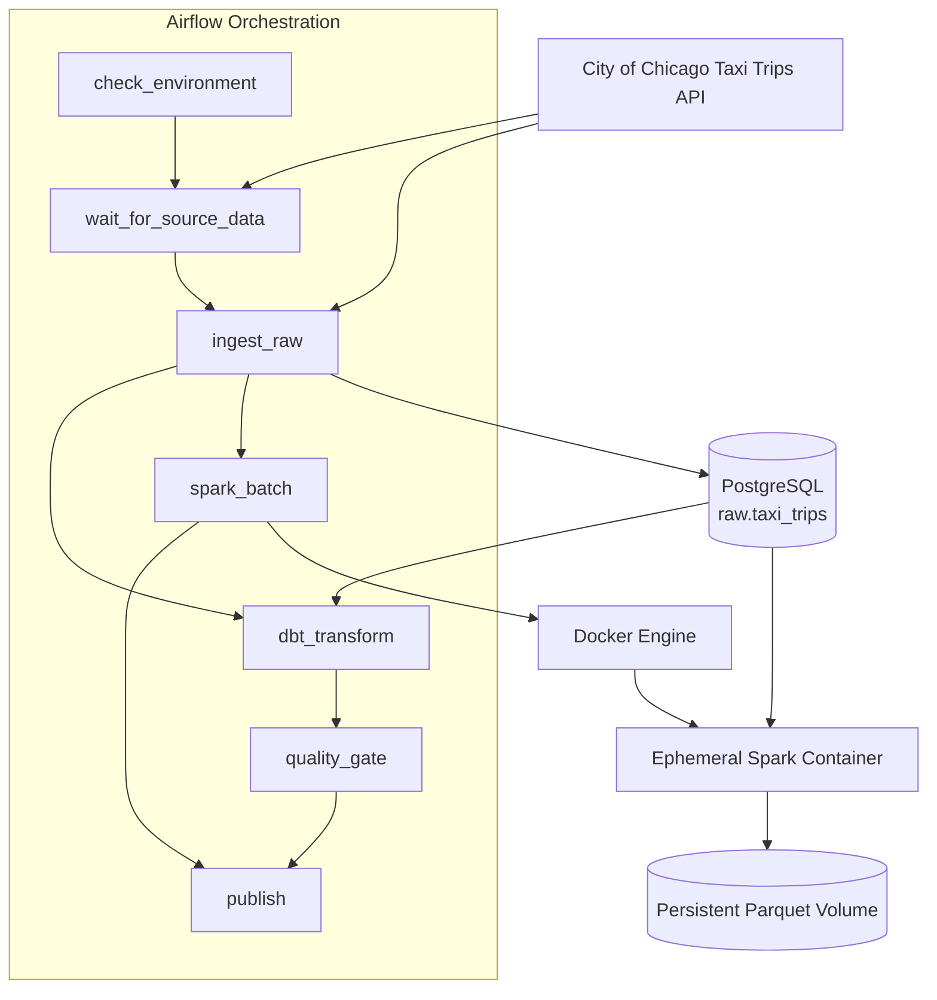

# Architecture

## 1. Overview

The Chicago Taxi Data Platform is a local containerized batch data platform built around:

- Apache Airflow for orchestration
- PostgreSQL for persistent raw data
- dbt for analytical transformation and data-quality validation
- PySpark for batch processing
- Parquet for persistent processed storage
- Docker Compose for service orchestration
- DockerOperator for on-demand Spark compute
- GitHub Actions for CI

The system ingests the City of Chicago Taxi Trips dataset, preserves the raw source representation in PostgreSQL, and processes the same Airflow data interval through two downstream paths:

1. dbt analytical modeling
2. Spark batch processing into partitioned Parquet

The platform is designed to support:

- delayed upstream publication
- historical backfills
- idempotent reruns
- partial failure recovery
- persistent storage independent of container lifecycle
- reproducible local startup

---

# 2. High-Level Architecture



The Airflow DAG controls orchestration, while Spark compute is launched only when required.

---

# 3. Runtime Components

## 3.1 Airflow

Airflow is responsible for:

- scheduling
- source availability checks
- task dependencies
- retries
- historical backfills
- Spark container creation
- pipeline state and logging

The platform uses the CeleryExecutor architecture.

The default Airflow runtime contains:

```text
airflow-webserver
airflow-scheduler
airflow-worker
airflow-triggerer
redis
postgres
```

where:

- `postgres` stores Airflow metadata
- `redis` acts as the Celery broker
- the Airflow worker executes regular tasks and communicates with Docker for Spark execution

---

## 3.2 Taxi Warehouse PostgreSQL

A separate PostgreSQL service, `postgres_local`, acts as the project warehouse.

The principal raw relation is:

```text
taxi_warehouse
└── raw
    └── taxi_trips
```

The warehouse is intentionally separate from the Airflow metadata database.

This separation prevents orchestration metadata and application data from sharing the same logical database.

---

## 3.3 dbt

dbt runs inside the Airflow environment rather than as a permanent standalone service.

The dbt path performs:

```text
raw.taxi_trips
      ↓
staging
      ↓
typed / normalized models
      ↓
dimensional marts
      ↓
dbt tests
```

The analytical model includes:

```text
fct_taxi_trips
dim_date
dim_location
dim_company
```

The dbt quality gate must succeed before the DAG is allowed to publish.

Detailed model definitions are documented in:

```text
docs/data_contract.md
docs/data_model.md
```

---

## 3.4 Spark

Spark runs as on-demand compute.

It is not kept permanently running in the default Docker Compose stack.

Instead:

```text
Airflow worker
     ↓
DockerOperator
     ↓
Docker daemon
     ↓
chicago-taxi-spark:1.0
     ↓
temporary Spark container
```

The Spark container:

1. joins the project Docker network
2. connects to the taxi warehouse using PostgreSQL JDBC
3. reads only the required Airflow interval
4. transforms raw taxi data
5. writes Parquet
6. validates output row counts
7. exits

The container itself is disposable.

The resulting Parquet data is persistent.

---

# 4. DAG Architecture

The final DAG contains seven tasks:

```text
check_environment
        │
        ▼
wait_for_source_data
        │
        ▼
    ingest_raw
       /   \
      /     \
     ▼       ▼
dbt_transform spark_batch
     │
     ▼
quality_gate
      \       /
       \     /
        ▼   ▼
        publish
```

## 4.1 `check_environment`

Performs lightweight environment validation before expensive work begins.

Its purpose is to fail early if required runtime components are unavailable.

---

## 4.2 `wait_for_source_data`

A PythonSensor checks whether the upstream dataset has published data through the required end of the monthly interval.

Conceptually:

```sql
SELECT max(trip_start_timestamp)
```

The latest source date is compared with the final date required by the Airflow interval.

Example:

```text
Airflow interval:
[2026-09-01, 2026-10-01)

Required final source date:
2026-09-30

Source max date:
2026-09-01

Result:
NOT READY
```

The sensor uses:

```text
mode = reschedule
poke interval = 6 hours
```

Therefore a source delay does not occupy a Celery worker continuously.

---

## 4.3 `ingest_raw`

Runs the Python ingestion program against the Airflow interval.

Example interface:

```bash
python ingest_taxi_trips.py \
  --start-date 2026-08-01 \
  --end-date 2026-09-01
```

The interval is interpreted as:

```text
[start_date, end_date)
```

The ingestion job internally divides a monthly interval into daily source queries.

---

## 4.4 `dbt_transform`

Runs dbt models against the warehouse.

The dbt branch transforms raw string-heavy source data into typed analytical models.

---

## 4.5 `quality_gate`

Runs dbt tests.

A failure here prevents downstream publication.

This task acts as the primary analytical data-quality gate.

---

## 4.6 `spark_batch`

Uses `DockerOperator` to start an ephemeral Spark container.

The task passes the same Airflow interval used by ingestion:

```text
--start-date
--end-date
```

This keeps ingestion and Spark aligned to the same logical batch.

---

## 4.7 `publish`

Represents successful completion of the usable platform outputs.

It only runs when both:

```text
quality_gate = success
spark_batch  = success
```

---

# 5. Scheduling Model

## 5.1 Monthly orchestration

The DAG is configured approximately as:

```text
schedule_interval = @monthly
timezone          = America/Chicago
catchup           = False
max_active_runs   = 1
```

The system originally used daily scheduling.

During validation, the upstream source was observed to publish data with significant delay rather than as a guaranteed daily feed.

A daily schedule therefore produced intervals for which source data did not yet exist.

The final design separates:

```text
orchestration cadence
```

from:

```text
storage partition granularity
```

Airflow operates monthly, while Spark still stores daily partitions.

---

## 5.2 Why `America/Chicago`?

The dataset represents Chicago taxi trips.

Using the Chicago timezone aligns Airflow calendar intervals with the business timezone of the source data.

Airflow internally persists timestamps in UTC, but schedule boundaries follow the configured timezone.

---

## 5.3 Why `catchup=False`?

The DAG supports historical data back to the beginning of the source dataset.

However, a new user should not automatically trigger every historical month when starting the platform for the first time.

Therefore:

```text
catchup=False
```

is used for normal scheduling.

Historical intervals are explicitly processed through backfills.

---

## 5.4 Why `max_active_runs=1`?

Only one monthly interval is allowed to execute at a time.

This avoids situations where several delayed source intervals simultaneously enter the sensor or ingestion path.

It also keeps local resource usage predictable.

---

# 6. Source-Aware Processing

Scheduling alone does not guarantee source readiness.

The platform therefore separates two concerns:

```text
Airflow schedule:
"When is this interval eligible to be considered?"

Sensor:
"Has the source actually published the interval yet?"
```

The sequence becomes:

```text
month closes
    ↓
Airflow creates interval
    ↓
Sensor checks source
    ↓
source incomplete
    ↓
reschedule
    ↓
check again later
    ↓
source ready
    ↓
ingestion begins
```

This prevents missing upstream data from being misclassified as a processing failure.

---

# 7. Ingestion Architecture

## 7.1 Monthly interval, daily source chunks

Although Airflow processes a monthly interval, the external API is queried one day at a time.

Example:

```text
Airflow interval:
[08/01, 09/01)

External API requests:
[08/01, 08/02)
[08/02, 08/03)
[08/03, 08/04)
...
[08/31, 09/01)
```

This design was introduced after a full-month paginated API request produced a real read timeout.

Daily chunking reduces:

- query size
- pagination depth
- remote API execution time
- probability of deep-page timeout

---

## 7.2 Pagination

Each daily source interval is paginated independently.

Example:

```text
08/10
│
├── page 1 → 5000 rows
├── page 2 → 5000 rows
├── page 3 → remaining rows
└── next page returns empty → stop
```

Each new day resets pagination to page 1.

---

## 7.3 HTTP client

The ingestion process creates one reusable `requests.Session`.

The same HTTP session is reused across:

```text
all days
+
all pages
```

in a single ingestion attempt.

Benefits include:

- connection pooling
- reduced TCP/TLS setup overhead
- consistent retry behavior

---

## 7.4 HTTP retries

The session is configured with a retry policy for transient failures.

Retryable conditions include selected cases such as:

```text
connection failure
read timeout
429 Too Many Requests
500
502
503
504
```

Retries use exponential backoff.

The SODA endpoint uses POST for read-only query operations, so retrying the project's POST queries does not modify upstream source state.

---

# 8. Raw Data Idempotency

The natural source identifier:

```text
trip_id
```

is used as the primary key of:

```text
raw.taxi_trips
```

Insert operations use:

```sql
ON CONFLICT (trip_id) DO NOTHING
```

This allows an ingestion task to be rerun after partial success.

Example:

```text
page 1 inserted
page 2 inserted
page 3 inserted
page 4 inserted
page 5 request fails

Airflow retries task
        ↓

pages 1–4 fetched again
        ↓

existing trip_id
        ↓

DO NOTHING
```

The retry therefore does not duplicate already committed data.

---

# 9. Ingestion Metadata

Raw rows also contain operational metadata such as:

```text
_ingested_at
_batch_id
_source_name
```

`_batch_id` identifies the ingestion attempt.

A single ingestion run uses one batch identifier across its pages and daily chunks.

This allows rows produced by the same ingestion attempt to be grouped operationally.

---

# 10. Database Bootstrap

The warehouse does not require a user to manually enter PostgreSQL and create tables.

The SQL bootstrap file:

```text
db/scripts/sql/create_tables.sql
```

is mounted into PostgreSQL's initialization directory:

```text
/docker-entrypoint-initdb.d/
```

For a fresh data volume:

```text
PostgreSQL starts
      ↓
initdb runs
      ↓
create_tables.sql executes
      ↓
raw schema created
      ↓
raw.taxi_trips created
```

The initialization scripts only run when PostgreSQL initializes an empty data directory.

Existing warehouse volumes keep their existing schema and data.

---

# 11. Spark Processing Architecture

Spark receives the same interval as ingestion.

Example:

```text
start = 2026-08-01
end   = 2026-09-01
```

The PostgreSQL JDBC source uses an interval predicate:

```sql
SELECT *
FROM raw.taxi_trips
WHERE trip_start_timestamp >= '2026-08-01T00:00:00'
  AND trip_start_timestamp <  '2026-09-01T00:00:00'
```

This prevents Spark from loading the entire historical raw table for each run.

---

# 12. Spark Transformation

Spark converts selected source fields into typed analytical columns.

A derived date column:

```text
trip_date
```

is created from the trip start timestamp.

This field becomes the physical Parquet partition key.

---

# 13. Parquet Storage

The output path inside the Spark environment is:

```text
/app/data/parquet/taxi_trips_by_date
```

The dataset is stored in a Docker named volume.

Physical layout:

```text
taxi_trips_by_date/
├── trip_date=2026-08-01/
│   └── part-....parquet
├── trip_date=2026-08-02/
│   └── part-....parquet
├── trip_date=2026-08-03/
│   └── part-....parquet
└── ...
```

This storage is independent from the lifetime of the Spark container.

---

# 14. Dynamic Partition Overwrite

Spark is configured to use dynamic partition overwrite.

If August is rerun:

```text
input interval:
[08/01, 09/01)
```

Spark overwrites partitions touched by that DataFrame:

```text
trip_date=08/01
trip_date=08/02
...
trip_date=08/31
```

but does not remove unrelated partitions such as:

```text
trip_date=07/31
trip_date=09/01
```

This makes Spark backfills and retries idempotent at the partition level.

---

# 15. Spark Validation

After writing the interval, Spark reloads the relevant Parquet interval and compares row counts.

Conceptually:

```text
PostgreSQL rows for interval
          ==
Parquet rows for interval
```

A mismatch raises an exception and fails the task.

This provides a basic completeness check between raw input and processed file output.

---

# 16. Docker Architecture

The project separates long-lived services from on-demand compute.

## Default services

```text
postgres
postgres_local
redis
airflow-init
airflow-webserver
airflow-scheduler
airflow-worker
airflow-triggerer
```

## Optional profiles

### `manual`

Used for manual Spark development and validation.

```text
spark
```

Example:

```bash
docker compose --profile manual run --rm spark ...
```

### `debug`

Used for optional operational debugging.

```text
flower
```

The production-like local path does not require either service to remain permanently running.

---

# 17. DockerOperator and Docker Socket

The Airflow worker mounts:

```text
/var/run/docker.sock
```

This allows code inside the Airflow worker container to communicate with the Docker daemon running on the host.

The relationship is:

```text
Airflow worker container
        │
        │ Docker API
        ▼
/var/run/docker.sock
        │
        ▼
Host Docker daemon
        │
        ▼
new Spark container
```

The Spark container is a sibling of the Airflow containers.

It is not a nested container running inside the Airflow worker.

---

# 18. Docker Network

The dynamically created Spark container must communicate with:

```text
postgres_local
```

using Docker DNS.

The Spark workload therefore joins the same project Docker network used by the platform services.

This allows:

```text
POSTGRES_HOST=postgres_local
```

to resolve correctly from the Spark container.

---

# 19. Persistence Model

The project separates container lifecycle from persistent state.

```text
Container
→ disposable runtime

Image
→ reusable execution environment

Docker volume
→ persistent state
```

Persistent data includes:

### Airflow metadata

Stored in the Airflow PostgreSQL data volume.

### Taxi raw data

Stored in the warehouse PostgreSQL volume.

### Spark output

Stored in:

```text
taxi-parquet-data
```

Therefore:

```bash
docker compose down
```

does not inherently remove platform data.

By contrast:

```bash
docker compose down -v
```

removes Compose-managed persistent volumes and should only be used intentionally.

---

# 20. Failure and Recovery Model

The platform handles failures at several different layers.

```text
Source not yet published
        ↓
Sensor reschedule

Short-lived network/API problem
        ↓
HTTP retry + backoff

Ingestion process ultimately fails
        ↓
Airflow task retry / rerun

Raw rows already committed
        ↓
trip_id conflict handling

Spark rerun
        ↓
dynamic partition overwrite
```

These mechanisms address different failure scopes rather than relying on one global retry mechanism.

---

# 21. Observed Failure

During a historical August 2026 ingestion run, the Chicago API timed out after multiple successful pages.

Observed error category:

```text
requests.exceptions.ReadTimeout
```

The failure showed that a full-month remote API query with deep pagination was unnecessarily fragile.

The final ingestion design was changed from:

```text
one monthly query
    ↓
deep pagination
```

to:

```text
monthly Airflow interval
    ↓
daily API intervals
    ↓
shallow pagination
    ↓
HTTP retry/backoff
```

The historical monthly run subsequently completed successfully.

---

# 22. Historical Backfills

Historical months are explicitly executed using Airflow backfill.

Example for August 2026:

```bash
docker compose exec airflow-worker \
  airflow dags backfill project1_taxi_pipeline \
  -s 2026-08-01 \
  -e 2026-08-02
```

The CLI date range is used to select the Chicago-timezone monthly logical run.

The resulting business data interval is:

```text
[2026-08-01, 2026-09-01)
```

Historical reruns are safe because both storage paths have idempotency controls.

---

# 23. Tested Workload

The final architecture was validated using an August 2026 historical run.

Observed local results were approximately:

```text
raw records:       ~598,000
ingestion runtime: ~8 minutes
```

The run exercised:

- monthly Airflow orchestration
- source-availability checks
- daily API chunking
- multi-page source ingestion
- PostgreSQL idempotency
- dbt transformation
- dbt quality tests
- Spark JDBC processing
- daily Parquet partitioning
- historical backfill execution

These values represent local validation results rather than production throughput benchmarks.

---

# 24. Clean-Start Behavior

A fresh environment is expected to follow:

```text
clone repository
      ↓
create .env
      ↓
build Airflow/platform images
      ↓
build Spark image
      ↓
airflow-init
      ↓
docker compose up
      ↓
warehouse automatically bootstraps
      ↓
Airflow loads DAG
      ↓
platform ready
```

No manual PostgreSQL table creation is required.

No permanently running Spark service is required.

---

# 25. CI Boundary

CI validates code and data-model correctness separately from the full local Docker runtime.

The repository includes automated checks for the Python/dbt project path.

The local Docker environment provides the integration validation layer for:

- Airflow orchestration
- PostgreSQL persistence
- Spark execution
- DockerOperator behavior
- networking
- persistent volumes

---

# 26. Design Trade-Offs

## Local Docker instead of cloud infrastructure

The goal of v1.0 is to demonstrate platform behavior reproducibly on a single development machine.

Cloud orchestration and object storage are intentionally outside the current scope.

---

## PostgreSQL raw layer instead of direct file ingestion

PostgreSQL provides:

- primary-key enforcement
- simple idempotent inserts
- SQL inspection
- dbt integration
- JDBC access for Spark

---

## Monthly scheduling instead of daily scheduling

The upstream publication pattern does not guarantee next-day availability.

Monthly scheduling plus a source sensor better reflects actual source behavior.

---

## Daily source chunks instead of one large monthly API query

Daily chunks reduce query complexity and deep pagination against the external API.

---

## Monthly Spark batch instead of one Spark job per day

The raw data is already local in PostgreSQL when Spark executes.

A single monthly Spark workload avoids starting a Spark runtime repeatedly for every individual day.

---

## Daily Parquet partitions despite monthly compute

Processing frequency and storage partitioning serve different purposes.

Daily partitions provide selective file access and targeted overwrite behavior without requiring daily Spark orchestration.

---

# 27. Current Boundaries

The v1.0 platform does not attempt to provide:

- distributed Spark cluster execution
- Kubernetes deployment
- cloud object storage
- real-time streaming
- exactly-once distributed messaging semantics
- full observability stack
- automatic alert delivery
- formal upstream completeness guarantees

The source sensor checks publication progress using the maximum available source timestamp.

That indicates source freshness but does not mathematically prove that every expected upstream row has arrived.

---

# 28. Future Architecture Extensions

Potential extensions include:

```text
Docker volume
      ↓
S3-compatible object storage

local Spark
      ↓
distributed Spark cluster

Airflow logs
      ↓
Prometheus / Grafana monitoring

source max timestamp
      ↓
stronger completeness metadata

local Docker Compose
      ↓
cloud / Kubernetes deployment

task-level metadata
      ↓
OpenLineage / Marquez
```

These are intentionally outside the v1.0 release.

---

# 29. Architecture Summary

The final platform can be summarized as:

```text
                       City of Chicago API
                                │
                                ▼
                      Source Availability
                             Sensor
                                │
                       source ready?
                         /          \
                       no            yes
                       │              │
                  reschedule          ▼
                              Monthly Interval
                                     │
                                     ▼
                              Daily API Chunks
                                     │
                              HTTP Retry/Backoff
                                     │
                                     ▼
                            raw.taxi_trips
                              /           \
                             /             \
                            ▼               ▼
                          dbt              Spark
                           │                 │
                           ▼                 ▼
                    Dimensional Marts   Daily Parquet
                           │            Partitions
                           ▼                 │
                     Quality Gate            │
                             \              /
                              \            /
                               ▼          ▼
                                  Publish
```

The architecture deliberately separates:

```text
source publication cadence
orchestration interval
API request granularity
compute granularity
storage partition granularity
```

rather than forcing all five concerns to use the same time grain.

That separation is the central design decision of the v1.0 platform.